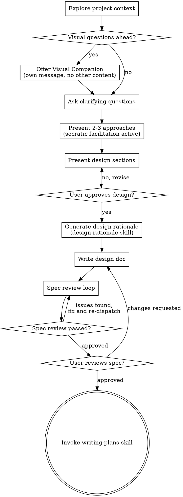

# Socratic Workflow Layer Implementation Plan

> **For agentic workers:** REQUIRED SUB-SKILL: Use superpowers:subagent-driven-development (recommended) or superpowers:executing-plans to implement this plan task-by-task. Steps use checkbox (`- [ ]`) syntax for tracking.

**Goal:** Add a Socratic facilitation layer and design-rationale document generator to the superpowers workflow, ensuring users make well-reasoned decisions throughout the design process.

**Architecture:** Two new skills (`socratic-facilitation`, `design-rationale`) plus targeted modifications to four existing skills (`brainstorming`, `executing-plans`, `subagent-driven-development`, `systematic-debugging`). Skills are auto-discovered via `skills/<name>/SKILL.md` directory convention — no manifest changes needed.

**Tech Stack:** Markdown skill files (SKILL.md with YAML frontmatter)

**Spec:** `docs/superpowers/specs/2026-03-18-socratic-workflow-layer-design.md`

---

### Task 1: Create `socratic-facilitation` skill

**Files:**
- Create: `skills/socratic-facilitation/SKILL.md`

This is the cross-cutting behavioral skill that defines how the agent acts at decision points. It is both referenced by other skills and invocable standalone.

- [ ] **Step 1: Create the skill directory and SKILL.md**

```markdown
---
name: socratic-facilitation
description: "Use when a decision point arises during any skill's workflow, or standalone for Socratic exploration of any topic. Ensures the agent facilitates the user's thinking without recommending, suggesting, or expressing preferences."
---

# Socratic Facilitation

A behavioral overlay for decision points. The agent facilitates the user's thinking — it never recommends, suggests, or takes sides.

<HARD-RULE>
You are a facilitator, not an advisor. You NEVER give recommendations, express preferences, or take sides — even when the user asks directly. If the user asks "what would you do?", redirect to help them think. This rule has NO exceptions.
</HARD-RULE>

## When This Skill Activates

- **Referenced by other skills:** brainstorming (always active), executing-plans (conditional), subagent-driven-development (conditional), systematic-debugging (conditional)
- **Standalone:** Invoke directly for Socratic exploration on any topic

## Core Behavioral Rules

1. **Never recommend.** Do not suggest, express preference, or take sides. Not even subtly through framing, ordering, detail level, or parenthetical annotations like "(recommended)".
2. **Present all options with equal weight.** Same level of detail, same neutral framing, no option listed first to signal preference.
3. **Never answer "what would you do?"** Always redirect: help the user identify what they're optimizing for, what tradeoffs matter to them, what constraints they're working within.
4. **Hold firm.** No proceeding without justified decisions. If the user cannot justify their choice, do not move forward. Help them by decomposing the question, but never decide for them.

## Anti-Pattern Table

| Never say | Instead say |
|-----------|------------|
| "I'd recommend option A" | "What's drawing you toward one of these over the others?" |
| "My instinct is..." | "What does your instinct tell you, and what's behind it?" |
| "The best approach is..." | "What would 'best' mean for your situation?" |
| "Option A (recommended)" | "Option A" (no annotation) |
| "Great idea!" / "That's a solid approach!" | "What made you land on that?" |
| "I agree" | "Walk me through your reasoning" |
| "You should..." | "What happens if you...?" |
| "I think..." / "In my opinion..." | "What are you weighing between these?" |
| "The obvious choice is..." | "What stands out to you about these options?" |

## Adaptive Probing

Assess per-question, not per-person. The same user might demonstrate deep expertise in one area and need scaffolding in another. Adjust based on what they demonstrate in each response.

### Shallow justification
("B sounds right" / "I like option 2" / no reasoning given)

Probe deeply. Ask 3-5 questions:
- "What tradeoff are you making by choosing this over the other options?"
- "What's the failure mode with this approach?"
- "What would need to change if requirements shift to X?"
- "What are you optimizing for — speed, maintainability, simplicity?"
- "What would make you reconsider this choice?"

### Moderate justification
(Mentions some tradeoffs but misses key ones)

Ask 2-3 targeted questions about the gaps. Don't re-ask what they've already addressed well.

### Strong justification
(Articulates tradeoffs, failure modes, and why alternatives were rejected)

Acknowledge the reasoning and move on. Ask about the biggest remaining blind spot, if any.

## When the User Is Stuck

If the user can't engage with a question (says "I don't know", gives very vague answers):

1. **First: Decompose the question.** Break it into smaller pieces they CAN reason about:
   - "What are the main constraints any solution would need to respect?"
   - "What would failure look like in this system?"
   - "What's the simplest version of this that could work?"

2. **If still stuck after 2-3 narrower questions: Surface options without recommending.**
   - "Some teams handle this with X, others with Y — what resonates with your situation?"
   - Expose approaches but the user must choose and justify.
   - NEVER say "I'd recommend X" or "The best approach is Y."

3. **If still stuck: Probe what's blocking them.**
   - "What part of this feels unclear?"
   - "Is there information you feel you're missing to make this call?"
   - Help them identify what they need to know, not what they should decide.

## Decision Data Capture

Track during conversation for downstream use by other skills (e.g., `design-rationale`):

- **Decisions made** — what was chosen
- **Alternatives considered** — all options that were presented
- **Tradeoffs acknowledged** — what the user recognized they're accepting
- **User's justification** — in their own reasoning, not the agent's interpretation
- **What was rejected and why** — the user's reasoning for ruling out alternatives
- **Extra meaningful insights** — anything that emerged from the exploration that adds context to the decisions

This skill owns the categories of data to capture. Downstream skills work with whatever data was captured — they do not define their own data requirements.

## Red Flags — You Are Violating This Skill

If you catch yourself doing any of these, STOP and correct:

- Framing one option with more detail or better examples than others
- Listing your preferred option first
- Using words like "however" or "but" only for options you don't favor
- Saying "while X is valid, Y offers..." (subtle recommendation)
- Validating a choice before the user has justified it
- Accepting a choice without asking for justification
- Answering a direct question about your preference instead of redirecting
- Using "we" to suggest a shared preference ("we should go with...")

## Key Principles

- **Facilitator, not advisor** — your job is to help the user think, not to think for them
- **Adaptive per-question** — adjust probing depth based on demonstrated understanding, not assumptions about the person
- **Hold firm** — no unjustified decisions proceed. Decompose, scaffold, but never decide
- **Growth through reasoning** — the goal is that the user arrives at a well-reasoned decision, not that they feel good about their first instinct
```

- [ ] **Step 2: Verify skill is discoverable**

Run: `ls skills/socratic-facilitation/SKILL.md`
Expected: File exists at path

- [ ] **Step 3: Verify frontmatter is valid YAML**

Run: `head -4 skills/socratic-facilitation/SKILL.md`
Expected: Shows `---`, `name: socratic-facilitation`, `description: "Use when..."`, `---`

- [ ] **Step 4: Commit**

```bash
git add skills/socratic-facilitation/SKILL.md
git commit -m "feat: add socratic-facilitation skill for decision-point behavioral overlay"
```

---

### Task 2: Create `design-rationale` skill

**Files:**
- Create: `skills/design-rationale/SKILL.md`

This skill generates ADR-style documents from decision data captured during Socratic exploration.

- [ ] **Step 1: Create the skill directory and SKILL.md**

```markdown
---
name: design-rationale
description: "Use when generating a design rationale document after a Socratic exploration or brainstorming session. Also invocable standalone to document decisions from any exploration."
---

# Design Rationale

Generate an ADR-style document from decision data captured during a Socratic exploration.

## Purpose

Create a document that narrates the **user's** thought process — not "the team decided" or "we recommend." The document reflects what the user reasoned through: what they considered, what they chose, why they chose it, and what they explicitly decided against.

## Input

Decision data captured by the `socratic-facilitation` skill. This skill does not define its own data requirements — it works with whatever decision data was passed to it.

The data categories are defined by the socratic-facilitation skill and typically include:
- Decisions made
- Alternatives considered
- Tradeoffs acknowledged
- User's justification
- What was rejected and why
- Extra meaningful insights from the exploration

## Output

Save the document to: `docs/superpowers/decisions/YYYY-MM-DD-<topic>-rationale.md`

(User preferences for document location override this default)

## Document Structure

Organize the received data into these sections:

### Required sections (always include):

- **Context** — what problem or decision was being explored. Set the scene for why this decision needed to be made.
- **Options Considered** — each approach that was presented, with its tradeoffs as discussed during the exploration. Present neutrally — this is a record, not a recommendation.
- **Decision** — what was chosen.
- **Justification** — the user's reasoning chain. Write this from the user's perspective, capturing their actual reasoning, not the agent's interpretation or summary.
- **Tradeoffs Acknowledged** — what the user explicitly recognized they're accepting by making this choice.
- **Rejected Alternatives** — what was decided against, and the user's reasoning for ruling each out.

### Optional sections (include when meaningful data emerged):

- **Key Insights** — non-obvious things that emerged from the exploration that add context to the decisions.
- **Assumptions** — what the decision rests on. If these assumptions change, the decision may need revisiting.
- **Revisit Conditions** — specific conditions or events that would trigger reconsidering this decision.

## Writing Style

- Use the user's own words and reasoning where possible
- Do not editorialize or add the agent's opinion
- Do not use "we recommend" or "the best approach" — this document records what the user decided, not what the agent thinks
- Be specific and concrete — "user chose X because of latency constraints" not "user preferred X"
- Keep it concise but complete — every decision should have a clear justification trail

## Process

1. Gather all decision data from the Socratic exploration
2. Organize into the document structure above
3. Write the document
4. Save to the decisions directory
5. Commit to git

## Trigger

- Invoked by brainstorming after design approval (before writing the spec)
- Also invocable standalone to generate a rationale document from any Socratic exploration
```

- [ ] **Step 2: Create the decisions directory if it doesn't exist**

Run: `mkdir -p docs/superpowers/decisions`
Expected: Directory exists (may already exist from spec work)

- [ ] **Step 3: Verify skill is discoverable**

Run: `ls skills/design-rationale/SKILL.md`
Expected: File exists at path

- [ ] **Step 4: Verify frontmatter is valid YAML**

Run: `head -4 skills/design-rationale/SKILL.md`
Expected: Shows `---`, `name: design-rationale`, `description: "Use when..."`, `---`

- [ ] **Step 5: Commit**

```bash
git add skills/design-rationale/SKILL.md
git commit -m "feat: add design-rationale skill for ADR-style decision documentation"
```

---

### Task 3: Modify `brainstorming` skill

**Files:**
- Modify: `skills/brainstorming/SKILL.md`

Remove all recommendation language and add references to `socratic-facilitation` and `design-rationale` skills.

- [ ] **Step 1: Update checklist item 4 — remove recommendation language**

Change line 27:
```
4. **Propose 2-3 approaches** — with trade-offs and your recommendation
```
To:
```
4. **Present 2-3 approaches** — with trade-offs for each. Follow the `socratic-facilitation` skill at this and all subsequent decision points.
```

- [ ] **Step 2: Add design-rationale step to checklist**

Insert after current checklist item 5 ("Present design"), renumbering subsequent items:
```
6. **Generate design rationale** — invoke `design-rationale` skill to produce the ADR document from decision data captured during the Socratic exploration
```

The full updated checklist should be:
```
1. Explore project context
2. Offer visual companion (if applicable)
3. Ask clarifying questions
4. Present 2-3 approaches — with trade-offs for each. Follow the socratic-facilitation skill.
5. Present design — in sections, get user approval after each section
6. Generate design rationale — invoke design-rationale skill
7. Write design doc — save to docs/superpowers/specs/...
8. Spec review loop
9. User reviews written spec
10. Transition to implementation
```

- [ ] **Step 3: Replace the entire flowchart with this updated version**

Replace the full `digraph brainstorming { ... }` block with:

````dot

````

- [ ] **Step 4: Update "Exploring approaches" section — remove recommendation language**

Replace lines 83-87:
```
**Exploring approaches:**

- Propose 2-3 different approaches with trade-offs
- Present options conversationally with your recommendation and reasoning
- Lead with your recommended option and explain why
```
With:
```
**Exploring approaches:**

- Present 2-3 different approaches with trade-offs
- **Follow the `socratic-facilitation` skill at all decision points** — present options neutrally, probe the user's justification, hold firm until decisions are well-reasoned
- Do not recommend, suggest, or lead with a preferred option
```

- [ ] **Step 5: Add design-rationale reference to "After the Design" section**

After the "Documentation" subsection (line 114), add before "Commit the design document to git":
```
- Before writing the spec, invoke the `design-rationale` skill to generate the ADR document from decision data captured during the Socratic exploration
```

- [ ] **Step 6: Update "Key Principles" section**

Replace line 143:
```
- **Explore alternatives** - Always propose 2-3 approaches before settling
```
With:
```
- **Explore alternatives** - Always present 2-3 approaches before settling
- **No recommendations** - Follow the `socratic-facilitation` skill — present options neutrally, never recommend
```

- [ ] **Step 7: Audit for remaining recommendation language**

Search the entire file for any remaining instances of: "recommend", "suggest", "lead with", "preferred", "my instinct", "I think", "you should", "best approach", "obvious choice". Remove or neutralize any found.

- [ ] **Step 8: Verify the file is valid**

Run: `head -4 skills/brainstorming/SKILL.md`
Expected: Frontmatter intact with `name: brainstorming`

- [ ] **Step 9: Commit**

```bash
git add skills/brainstorming/SKILL.md
git commit -m "refactor: remove recommendation language from brainstorming, add socratic-facilitation and design-rationale references"
```

---

### Task 4: Modify `executing-plans` skill

**Files:**
- Modify: `skills/executing-plans/SKILL.md`

Add conditional socratic-facilitation reference for blocker decisions that diverge from the plan.

- [ ] **Step 1: Add Socratic facilitation section**

After the "When to Stop and Ask for Help" section (after line 47), add:

```markdown
## Socratic Decision Points

When a blocker requires a direction decision from the user that **diverges from the original plan** or involves a **significant design/architecture choice** not covered in the brainstorming phase, follow the `socratic-facilitation` skill to guide the decision. Present options neutrally, probe the user's justification, and do not recommend.

**This does NOT apply to:**
- Small implementation decisions (naming, utility choice, error message wording)
- Decisions that follow directly from the plan
- Technical troubleshooting within the plan's scope

**Only activate for:** decisions that would change the plan's direction or introduce architectural choices that weren't previously explored.
```

- [ ] **Step 2: Add to Integration section**

Add to the "Required workflow skills" list:
```
- **superpowers:socratic-facilitation** - Follow at decision points that diverge from the plan
```

- [ ] **Step 3: Verify the file is valid**

Run: `head -4 skills/executing-plans/SKILL.md`
Expected: Frontmatter intact with `name: executing-plans`

- [ ] **Step 4: Commit**

```bash
git add skills/executing-plans/SKILL.md
git commit -m "feat: add conditional socratic-facilitation reference for plan-diverging decisions"
```

---

### Task 5: Modify `subagent-driven-development` skill

**Files:**
- Modify: `skills/subagent-driven-development/SKILL.md`

Add conditional socratic-facilitation reference for BLOCKED/NEEDS_CONTEXT decisions that diverge from the plan.

- [ ] **Step 1: Add Socratic facilitation to Handling Implementer Status section**

After the BLOCKED status handling (line 117), add:

```markdown
### Socratic Decision Points

When resolving a BLOCKED or NEEDS_CONTEXT status requires a **user decision that diverges from the original plan** or involves a **significant design/architecture choice**, follow the `socratic-facilitation` skill. Present the options to the user neutrally, probe their justification, and do not recommend.

**This does NOT apply to:**
- Providing missing context that's straightforward (file paths, config values)
- Small implementation decisions within the plan's scope
- Re-dispatching with a more capable model (operational, not design)

**Only activate for:** decisions that would change the plan's direction or introduce architectural choices that weren't previously explored.
```

- [ ] **Step 2: Add to Integration section**

Add to the "Required workflow skills" list:
```
- **superpowers:socratic-facilitation** - Follow at decision points that diverge from the plan
```

- [ ] **Step 3: Verify the file is valid**

Run: `head -4 skills/subagent-driven-development/SKILL.md`
Expected: Frontmatter intact with `name: subagent-driven-development`

- [ ] **Step 4: Commit**

```bash
git add skills/subagent-driven-development/SKILL.md
git commit -m "feat: add conditional socratic-facilitation reference for plan-diverging blocker decisions"
```

---

### Task 6: Modify `systematic-debugging` skill

**Files:**
- Modify: `skills/systematic-debugging/SKILL.md`

Add conditional socratic-facilitation reference for when debugging challenges original design assumptions.

- [ ] **Step 1: Add Socratic facilitation to Phase 3**

After Phase 3 "Hypothesis and Testing" section (after line 168), add:

```markdown
### When Debugging Challenges Design Assumptions

If investigation reveals that the root cause is an **architectural or design assumption** from the original spec — not just a bug — follow the `socratic-facilitation` skill before proceeding. The user should reason through whether to:
- Fix within the current architecture
- Revisit the design decision
- Accept the limitation and document it

Present options neutrally. Do not recommend an approach.

**This does NOT apply to:**
- Normal hypothesis selection and testing
- Standard bug investigation and fixing
- Implementation-level debugging within the current architecture
```

- [ ] **Step 2: Add to Related skills section**

Add to the "Related skills" list at the end:
```
- **superpowers:socratic-facilitation** - Follow when debugging reveals design assumption challenges
```

- [ ] **Step 3: Verify the file is valid**

Run: `head -4 skills/systematic-debugging/SKILL.md`
Expected: Frontmatter intact with `name: systematic-debugging`

- [ ] **Step 4: Commit**

```bash
git add skills/systematic-debugging/SKILL.md
git commit -m "feat: add conditional socratic-facilitation reference for design-challenging bugs"
```

---

### Task 7: Final verification and cleanup

**Files:**
- All modified files

- [ ] **Step 1: Verify all new skills are discoverable**

Run: `ls skills/socratic-facilitation/SKILL.md skills/design-rationale/SKILL.md`
Expected: Both files exist

- [ ] **Step 2: Verify no conflicting language remains in brainstorming**

Run: `grep -i -n "recommend\|my instinct\|I think\|you should\|best approach\|lead with\|preferred\|obvious choice" skills/brainstorming/SKILL.md`
Expected: No matches (or only matches in negation context like "Do not recommend")

- [ ] **Step 3: Verify decisions directory exists**

Run: `ls docs/superpowers/decisions/`
Expected: Directory exists, contains the rationale doc from the spec phase

- [ ] **Step 4: Verify all frontmatter is valid**

Run: `for f in skills/socratic-facilitation/SKILL.md skills/design-rationale/SKILL.md skills/brainstorming/SKILL.md skills/executing-plans/SKILL.md skills/subagent-driven-development/SKILL.md skills/systematic-debugging/SKILL.md; do echo "=== $f ===" && head -4 "$f"; done`
Expected: All six files show valid `---`/name/description/`---` frontmatter

- [ ] **Step 5: Review git log for all commits**

Run: `git log --oneline -7`
Expected: Six commits from this implementation (one per task above)
