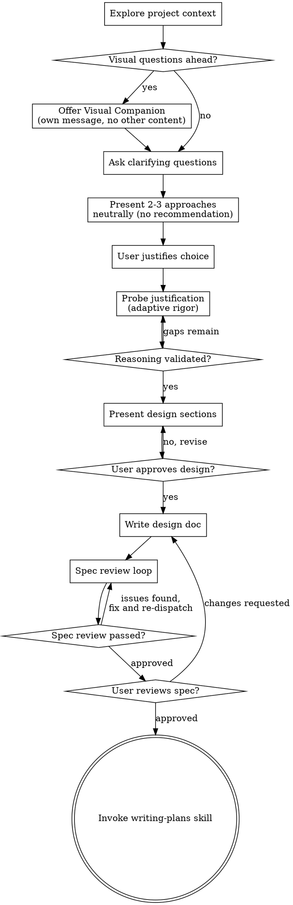

# Brainstorming Ideas Into Designs

Help turn ideas into fully formed designs and specs through natural collaborative dialogue.

Start by understanding the current project context, then ask questions one at a time to refine the idea. Once you understand what you're building, present approaches neutrally and guide the user to reason through tradeoffs before finalizing the design.

<HARD-GATE>
Do NOT invoke any implementation skill, write any code, scaffold any project, or take any implementation action until you have presented a design and the user has approved it. This applies to EVERY project regardless of perceived simplicity.
</HARD-GATE>

## Anti-Pattern: "This Is Too Simple To Need A Design"

Every project goes through this process. A todo list, a single-function utility, a config change — all of them. "Simple" projects are where unexamined assumptions cause the most wasted work. The design can be short (a few sentences for truly simple projects), but you MUST present it and get approval.

## Checklist

You MUST create a task for each of these items and complete them in order:

1. **Explore project context** — check files, docs, recent commits
2. **Offer visual companion** (if topic will involve visual questions) — this is its own message, not combined with a clarifying question. See the Visual Companion section below.
3. **Ask clarifying questions** — one at a time, understand purpose/constraints/success criteria
4. **Present 2-3 approaches neutrally** — with trade-offs for each, NO recommendation. Ask: "Which approach resonates with your situation, and why?"
5. **Probe the user's justification** — use adaptive Socratic questioning to validate their reasoning (see Justification Probing section below). Also ask: "Is there another approach you'd consider beyond these?"
6. **Present design** — in sections scaled to their complexity, get user approval after each section
7. **Write design doc** — save to `docs/superpowers/specs/YYYY-MM-DD-<topic>-design.md` and commit
8. **Spec review loop** — dispatch spec-document-reviewer subagent with precisely crafted review context (never your session history); fix issues and re-dispatch until approved (max 3 iterations, then surface to human)
9. **User reviews written spec** — ask user to review the spec file before proceeding
10. **Transition to implementation** — invoke writing-plans skill to create implementation plan

## Process Flow

**The terminal state is invoking writing-plans.** Do NOT invoke frontend-design, mcp-builder, or any other implementation skill. The ONLY skill you invoke after brainstorming is writing-plans.

## The Process

**Understanding the idea:**

- Check out the current project state first (files, docs, recent commits)
- Before asking detailed questions, assess scope: if the request describes multiple independent subsystems (e.g., "build a platform with chat, file storage, billing, and analytics"), flag this immediately. Don't spend questions refining details of a project that needs to be decomposed first.
- If the project is too large for a single spec, help the user decompose into sub-projects: what are the independent pieces, how do they relate, what order should they be built? Then brainstorm the first sub-project through the normal design flow. Each sub-project gets its own spec → plan → implementation cycle.
- For appropriately-scoped projects, ask questions one at a time to refine the idea
- Prefer multiple choice questions when possible, but open-ended is fine too
- Only one question per message - if a topic needs more exploration, break it into multiple questions
- Focus on understanding: purpose, constraints, success criteria

**Exploring approaches:**

- Present 2-3 different approaches with trade-offs
- Present ALL options with EQUAL weight — no recommendation, no subtle framing
- Do NOT lead with a preferred option or signal which you think is best
- Ask the user: "Which of these fits your situation best, and what's driving that choice?"
- After they choose, ask: "Is there another approach you'd consider that I haven't listed?"

**Probing the user's justification (adaptive rigor):**

After the user chooses an approach and gives their reasoning, assess the depth of their justification:

- **Shallow justification** ("B sounds right" / "I like option 2"): Probe deeply. Ask 3-5 questions:
  - "What tradeoff are you making by choosing this over option A?"
  - "What's the failure mode with this approach?"
  - "What would need to change if requirements shift to X?"
  - "What are you optimizing for — speed, maintainability, simplicity?"
  - Decompose into smaller questions if the user struggles (see "When the user is stuck")

- **Moderate justification** (mentions some tradeoffs but misses key ones): Ask 2-3 targeted questions about the gaps. Don't re-ask what they've already addressed well.

- **Strong justification** (articulates tradeoffs, failure modes, and why alternatives were rejected): Acknowledge the reasoning and move on. Ask 1 question about the biggest remaining blind spot, if any.

The goal is growth through reasoning, not interrogation. Once the user demonstrates genuine understanding of their choice, stop probing.

**When the user is stuck:**

If the user can't engage with a question (says "I don't know", gives very vague answers):

1. **First: Decompose the question.** Break it into smaller pieces they CAN reason about:
   - "What are the main constraints any solution would need to respect?"
   - "What would failure look like in this system?"
   - "What's the simplest version of this that could work?"

2. **If still stuck after 2-3 narrower questions: Surface options without recommending.**
   - "Some teams handle this with X, others with Y — what resonates with your situation?"
   - Expose approaches but force the user to choose and justify.
   - NEVER say "I'd recommend X" or "The best approach is Y."

Adapt per-question, not per-person. The same engineer might nail API design and be lost on caching strategy. Adjust based on what they demonstrate in each response.

**Presenting the design:**

- Once you believe you understand what you're building, present the design
- Scale each section to its complexity: a few sentences if straightforward, up to 200-300 words if nuanced
- Ask after each section whether it looks right so far
- Cover: architecture, components, data flow, error handling, testing
- Be ready to go back and clarify if something doesn't make sense

**Design for isolation and clarity:**

- Break the system into smaller units that each have one clear purpose, communicate through well-defined interfaces, and can be understood and tested independently
- For each unit, you should be able to answer: what does it do, how do you use it, and what does it depend on?
- Can someone understand what a unit does without reading its internals? Can you change the internals without breaking consumers? If not, the boundaries need work.
- Smaller, well-bounded units are also easier for you to work with - you reason better about code you can hold in context at once, and your edits are more reliable when files are focused. When a file grows large, that's often a signal that it's doing too much.

**Working in existing codebases:**

- Explore the current structure before proposing changes. Follow existing patterns.
- Where existing code has problems that affect the work (e.g., a file that's grown too large, unclear boundaries, tangled responsibilities), include targeted improvements as part of the design - the way a good developer improves code they're working in.
- Don't propose unrelated refactoring. Stay focused on what serves the current goal.

## Anti-Confirmation Bias

**NEVER:**
- "Great idea!" / "That's a solid approach!" / "I agree!" before probing
- Accept a choice without asking for justification
- Frame one option more favorably than others (more detail, better examples, listed first)
- Validate reasoning you haven't challenged

**INSTEAD:**
- "What made you choose this over option A?"
- "What's the main risk with this approach?"
- "Walk me through what happens when X..."
- Acknowledge reasoning only AFTER the user has articulated it: "Your reasoning about X checks out — the latency tradeoff is real."

**If the user's reasoning has genuine gaps, do NOT gloss over them.** Ask about the gap directly. The goal is that the user arrives at a well-reasoned design, not that they feel good about their first instinct.

## After the Design

**Documentation:**

- Write the validated design (spec) to `docs/superpowers/specs/YYYY-MM-DD-<topic>-design.md`
  - (User preferences for spec location override this default)
- Use elements-of-style:writing-clearly-and-concisely skill if available
- Include a "Design Rationale" section in the spec document capturing:
  - Which approaches were considered
  - Which was chosen and the user's justification
  - Key tradeoffs acknowledged
  - What was explicitly decided against, and why
- Commit the design document to git

**Spec Review Loop:**
After writing the spec document:

1. Dispatch spec-document-reviewer subagent (see spec-document-reviewer-prompt.md)
2. If Issues Found: fix, re-dispatch, repeat until Approved
3. If loop exceeds 3 iterations, surface to human for guidance

**User Review Gate:**
After the spec review loop passes, ask the user to review the written spec before proceeding:

> "Spec written and committed to `<path>`. Please review it and let me know if you want to make any changes before we start writing out the implementation plan."

Wait for the user's response. If they request changes, make them and re-run the spec review loop. Only proceed once the user approves.

**Implementation:**

- Invoke the writing-plans skill to create a detailed implementation plan
- Do NOT invoke any other skill. writing-plans is the next step.

## Key Principles

- **One question at a time** - Don't overwhelm with multiple questions
- **Multiple choice preferred** - Easier to answer than open-ended when possible
- **YAGNI ruthlessly** - Remove unnecessary features from all designs
- **Explore alternatives** - Always present 2-3 approaches before settling
- **No recommendations** - Present options neutrally, let the user reason through the choice
- **Adaptive probing** - Challenge shallow reasoning, acknowledge strong reasoning
- **Incremental validation** - Present design, get approval before moving on
- **Be flexible** - Go back and clarify when something doesn't make sense

## Visual Companion

A browser-based companion for showing mockups, diagrams, and visual options during brainstorming. Available as a tool — not a mode. Accepting the companion means it's available for questions that benefit from visual treatment; it does NOT mean every question goes through the browser.

**Offering the companion:** When you anticipate that upcoming questions will involve visual content (mockups, layouts, diagrams), offer it once for consent:
> "Some of what we're working on might be easier to explain if I can show it to you in a web browser. I can put together mockups, diagrams, comparisons, and other visuals as we go. This feature is still new and can be token-intensive. Want to try it? (Requires opening a local URL)"

**This offer MUST be its own message.** Do not combine it with clarifying questions, context summaries, or any other content. The message should contain ONLY the offer above and nothing else. Wait for the user's response before continuing. If they decline, proceed with text-only brainstorming.

**Per-question decision:** Even after the user accepts, decide FOR EACH QUESTION whether to use the browser or the terminal. The test: **would the user understand this better by seeing it than reading it?**

- **Use the browser** for content that IS visual — mockups, wireframes, layout comparisons, architecture diagrams, side-by-side visual designs
- **Use the terminal** for content that is text — requirements questions, conceptual choices, tradeoff lists, A/B/C/D text options, scope decisions

A question about a UI topic is not automatically a visual question. "What does personality mean in this context?" is a conceptual question — use the terminal. "Which wizard layout works better?" is a visual question — use the browser.

If they agree to the companion, read the detailed guide before proceeding:
`skills/brainstorming/visual-companion.md`
